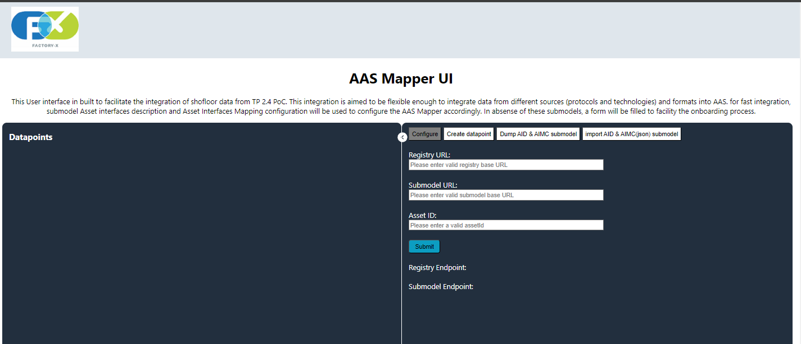
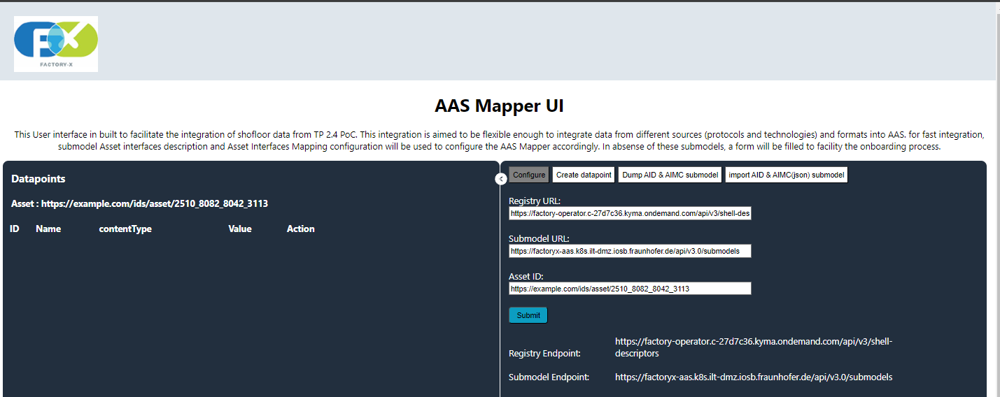
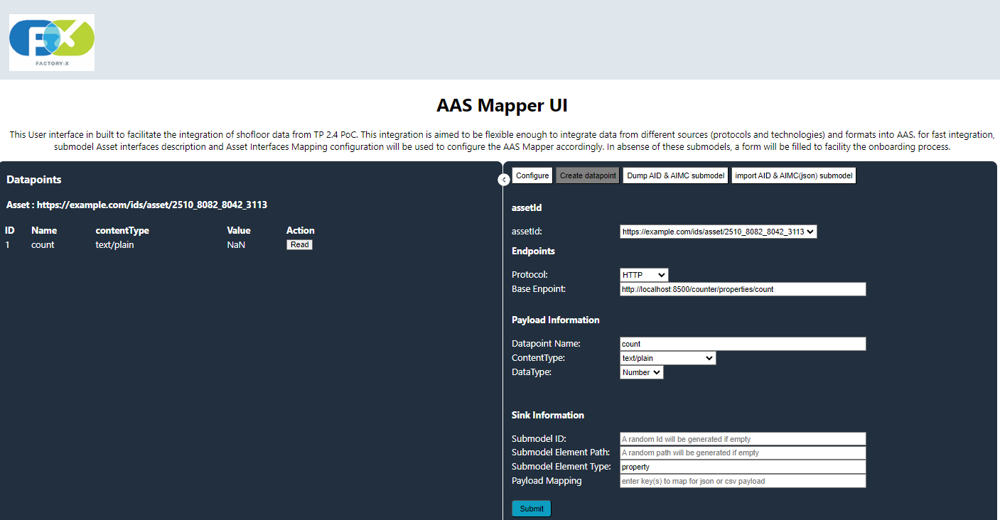

>[!NOTE]
This repository is still work in progress and not intended for **production purpose**. It is developed as part of the components for **TP 2.4 PoC**.

# fx-ccm-dataspace-poc-mapping

Asset Administration Shell(AAS) Mapper is a **python (back-end)** and **react (front-end)** based implementation to integrate shopfloor data into AAS.

The react front-end is a simple UI that help facilitate the inputation of endpoints that AAS mapper is interfacing with and also datapoints of the shopfloor asset. 

The UI has two blocks, left block is used to show assets datapoints and right block is used for inputing data. On the right block there are four options that serve different purposes. 

The configure option enables the input of registry endpoint, submodel endpoint and aasetId of the asset of interest. upon submitting these information. an asset object is created using /configInfo API. if everything is successful, The UI look like the screenshot below.

The create datapoint option enables user to create a datapoint that it wants to integrate from asset (shopfloor device) to AAS infrastructure (AAS submodel format). upon submiting information needed to creating a datapoint. a datapoint object is create with associated asset(mapped by assetId) using /adddatapoint API. If everything is done correctly, screenshot below should be seen.

The **Read** button can be used to initiate a read function using /readdatapoint/?id=datapointId&assetId=assetId API. 

This project can either be run individually in  a local machine or deployed together using docker. 

There is a data-source(simulating a simple asset) that can be replaced by user's asset of interest. 

>[!WARNING]
for the front-end to communicate with the back-end accordingly, do not forget to update the **proxy** parameter in **package.josn** file in **react-front-end** folder.

